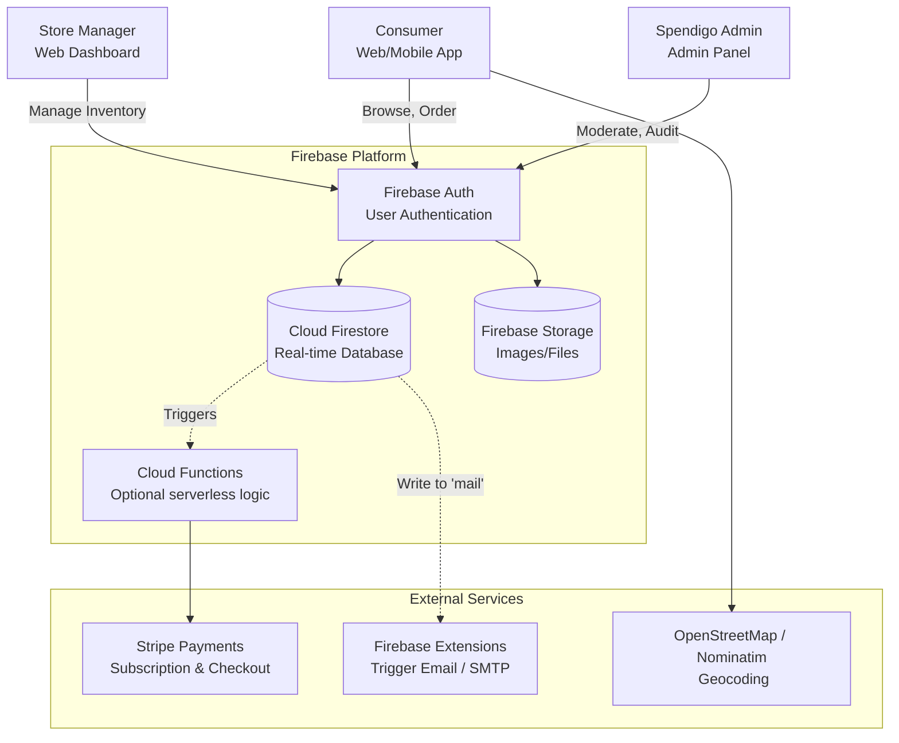
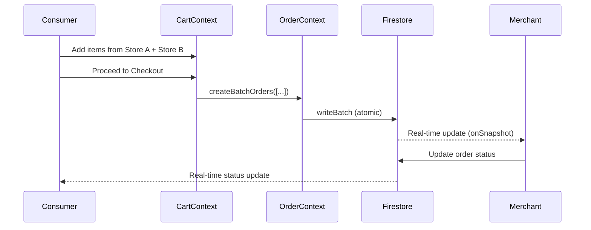
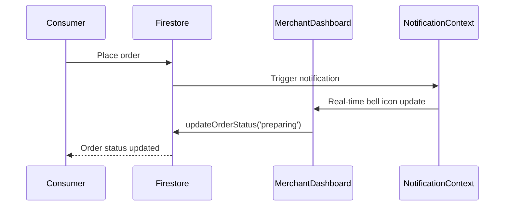

# Spendigo SmartCart — System Architecture

**Last Updated**: 2025-12-30  
**Status**: Production (Firebase-Based Implementation)

---

## 1. Executive Summary

Spendigo SmartCart is a Canada-first marketplace facilitator connecting independent convenience stores with consumers. The **current implementation** uses **Firebase** as a managed backend, enabling rapid development and automatic scalability while maintaining production-grade security.

---

## 2. C4 Model - Context Diagram (As Implemented)



---

## 3. Container Architecture (Actual Implementation)

### 3.1 Frontend Applications

| Application | Technology | Status |
|------------|------------|--------|
| **Consumer Web** | React 18 + Vite 7 | ✅ Complete |
| **Merchant Dashboard** | React 18 + Vite 7 | ✅ Complete |
| **Admin Panel** | React 18 + Vite 7 | ✅ Complete |
| **Mobile Apps** | Capacitor 6 (iOS/Android) | ✅ Ready for build |

**Shared Codebase**: Single React app with role-based routing (`ConsumerLayout`, `MerchantLayout`, `AdminLayout`)

### 3.2 Backend Services (Hybrid)

The architecture uses a **Hybrid approach**:
1.  **Client-Side**: Firebase SDKs for real-time data sync and simple CRUD (handled via React Contexts).
2.  **Server-Side**: Cloud Functions (Node.js) for privileged operations, extensive logic, and third-party integrations.

| Component | Technology | Responsibilities |
|-----------|------------|------------------|
| **React Contexts** | Client SDK | Auth state, realtime order listeners, cart management |
| **Cloud Functions** | Node.js 20 | Order emails, complex admin actions (user deletion), Stripe webhooks, maintenance tasks |
| **Firebase Extensions** | Trigger Email | Outbound transactional emails via Firestore `mail` collection |

### 3.3 Data Store (Firebase Firestore)

**Collection Structure**:
```
/users/{userId}              # User profiles + roles
/stores/{storeId}            # Merchant stores
  /flyers/{flyerId}          # Digital flyers (subcollection)
/orders/{orderId}            # Order documents
/catalog/{productId}         # Master product catalog
/audit_logs/{logId}          # Tamper-evident security logs
/notifications/{userId}      # In-app notifications
/mail/{mailId}               # Outbound emails (Trigger Email Extension)
/carts/{userId}              # Shopping carts
/wishlists/{userId}          # User wishlists
/settings/platform           # Global settings (maintenance mode, etc.)
```

**Key Features**:
- Real-time listeners (`onSnapshot`) for instant UI updates
- Atomic batch writes for multi-store checkout
- Security rules enforce RBAC at database level
- Offline persistence enabled

---

## 4. Key Data Flows

### 4.1 Consumer Checkout (Multi-Store)



### 4.2 Merchant Order Management



---

## 5. Security & Compliance (Implemented)

| Feature | Implementation | Status |
|---------|----------------|--------|
| **Authentication** | Firebase Auth (Email/Password) | ✅ Complete |
| **SSO** | Google (Firebase Auth) | ✅ Complete |
| **Authorization** | RBAC (Consumer/Merchant/Admin) | ✅ Complete |
| **Route Guards** | Layout-level checks | ✅ Complete |
| **Audit Logging** | SHA-256 hash chain | ✅ Complete |
| **Data Isolation** | Per-user Firestore docs | ✅ Complete |
| **HTTPS/SSL** | Local dev certificate | ✅ Complete |
| **Maintenance Mode** | Global platform lockdown | ✅ Complete |
| **Suspended Stores** | Auto-logout enforcement | ✅ Complete |

---

## 6. Infrastructure (Current)

| Component | Technology | Configuration |
|-----------|------------|---------------|
| **Hosting** | Local dev server | Vite dev server on port 443 |
| **Database** | Cloud Firestore | Auto-scaling, real-time |
| **Storage** | Firebase Storage | 1GB free tier |
| **CI/CD** | Manual | 🔜 GitHub Actions planned |
| **Monitoring** | Console logs | 🔜 Sentry planned |
| **Domain** | spendigo.ca | Local DNS mapping |

---

## 7. Deployment Architecture

### Development
```bash
npm run dev
# Runs on https://spendigo.ca:446/
```

### Production
```bash
npm run build
# Output: apps/web/dist/ (876kb bundle)
# Deploy to Firebase Hosting, Vercel, or Netlify
```

### Mobile
```bash
npx cap sync
npx cap open ios     # Xcode
npx cap open android # Android Studio
```

---

## 8. Differences from Original Plan

| Original Plan | Current Implementation | Rationale |
|---------------|------------------------|-----------|
| PostgreSQL + Drizzle | Cloud Firestore | Faster development, real-time sync |
| Custom backend functions | Firebase client SDKs | Eliminates server management |
| Stripe backend integration | Client-side simulation | MVP focus, backend ready for production |
| Serverless deployment | Static site + Firebase | Simpler hosting, lower cost |

---

## 9. Future Enhancements

### Short-Term (Q1 2026)
- [ ] Native Mobile QA (iOS/Android)
- [ ] Sentry Error Monitoring
- [ ] Privacy & TOS Compliance

### Medium-Term (Post-Beta)
- [ ] Stripe Connect (Marketplace Split)
- [ ] Native Push Notifications (FCM)
- [ ] Advanced Search (Algolia)

### Long-Term (Growth)
- [ ] Server-side rendering (Next.js migration)
- [ ] ML-based product recommendations
- [ ] Multi-region deployment

---

**For detailed collection schemas, see**: [SCHEMA.md](./SCHEMA.md)  
**For complete tech stack, see**: [TECH_STACK.md](./TECH_STACK.md)
