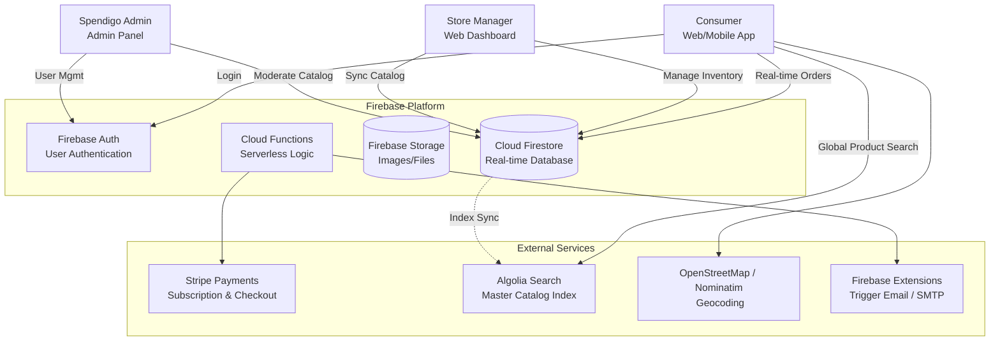
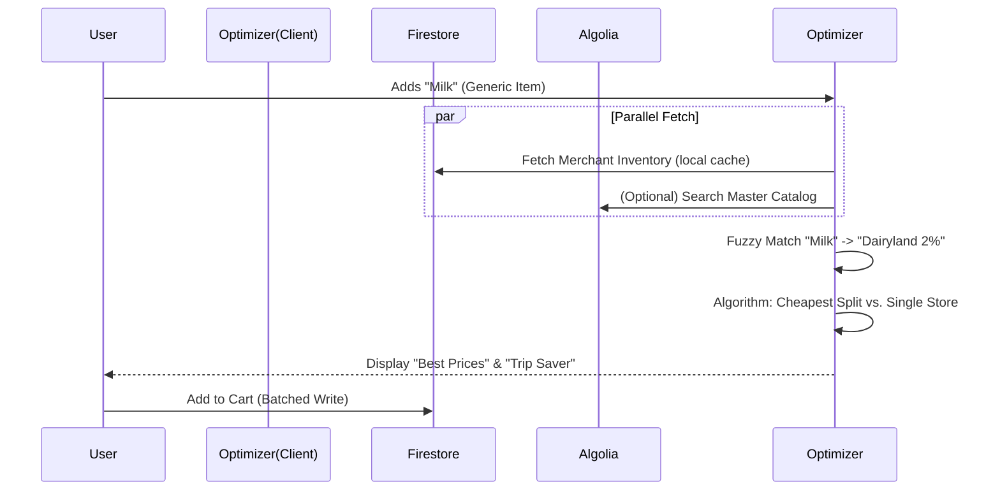
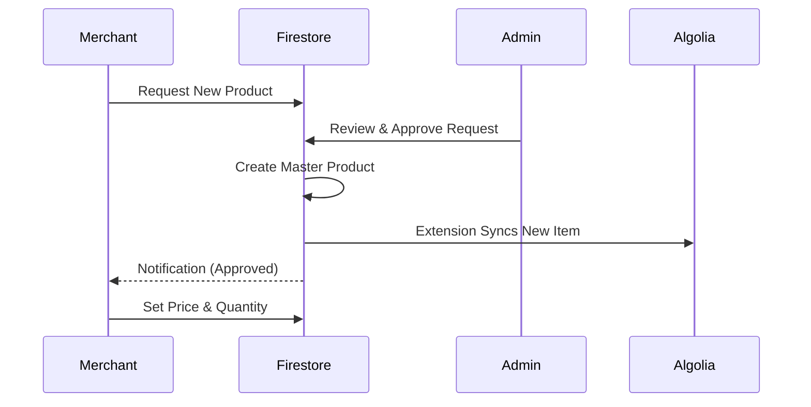

# Spendigo SmartCart — System Architecture

**Last Updated**: 2026-01-12
**Status**: Beta (Feature Complete & Optimization Phase)

---

## 1. Executive Summary

Spendigo SmartCart is a Canada-first marketplace facilitator connecting independent convenience stores with consumers. The **current implementation** uses a **Hybrid Architecture**:
-   **Backend**: Firebase (Firestore, Auth, Functions) for core data and logic.
-   **Search**: **Algolia** for high-performance Master Catalog search.
-   **Optimization**: Client-side SmartCart Optimizer with local heuristic algorithms (Store Splitting & Trip Optimization).

---

## 2. C4 Model - Context Diagram (As Implemented)



---

## 3. Container Architecture (Actual Implementation)

### 3.1 Frontend Applications

| Application | Technology | Status |
|------------|------------|--------|
| **Consumer Web** | React 18 + Vite 7.3 | ✅ Complete |
| **Merchant Dashboard** | React 18 + Vite 7.3 | ✅ Complete |
| **Admin Panel** | React 18 + Vite 7.3 | ✅ Complete |
| **Mobile Apps** | Capacitor 6 (iOS/Android) | ✅ Build Verified |

**Shared Codebase**: Single React app with role-based routing (`ConsumerLayout`, `MerchantLayout`, `AdminLayout`) and shared Design System (`hsl` tokens).

### 3.2 Backend Services (Hybrid)

The architecture uses a **Hybrid approach**:
1.  **Client-Side**: Firebase SDKs for real-time data sync (Orders, Inventory) and simple CRUD.
2.  **Server-Side**: Cloud Functions (Node.js) for privileged operations (Order Emails, Stripe Webhooks, Admin Tasks).

| Component | Technology | Responsibilities |
|-----------|------------|------------------|
| **React Contexts** | Client SDK | Auth state, realtime order listeners, cart management, *SmartCart Optimizer Logic* |
| **Cloud Functions** | Node.js 20 | Order emails, complex admin actions, Stripe webhooks, maintenance tasks |
| **Algolia Extension** | Firebase Extension | Syncs `master_products` to Algolia index for fuzzy search |

### 3.3 Data Store (Firebase Firestore)

**Collection Structure**:
```
/users/{userId}              # User profiles + roles
/stores/{storeId}            # Merchant stores
/orders/{orderId}            # Order documents
/master_products/{mpId}      # Global verified catalog (Synced to Algolia)
/merchant_products/{pId}     # Store-specific inventory & pricing
/product_creation_requests/  # Merchant requests for new products
/carts/{userId}              # Shopping carts
/wishlists/{userId}          # User wishlists
```

**Key Architectural Decisions**:
- **Hybrid Catalog**: Separation of `master_products` (Global Data) and `merchant_products` (Store Data). Merchants link to a Master ID, ensuring consistent data quality while allowing flexible pricing.
- **SmartCart Optimizer**: Runs entirely on the client-side (`useMemo` in `SmartCartWishlist.tsx`). It downloads relevant availability data and performs:
    1.  **Fuzzy Matching**: Matches generic terms ("Milk") to specific inventory ("Dairyland Milk").
    2.  **Store Splitting**: Finds the cheapest combination of stores.
    3.  **Trip Optimization**: Suggests a "Best Single Store" alternative.

---

## 4. Key Data Flows

### 4.1 SmartCart Optimization Flow



### 4.2 Admin Catalog Verification



---

## 5. Security & Compliance (Implemented)

| Feature | Implementation | Status |
|---------|----------------|--------|
| **Authentication** | Firebase Auth (Email/Password + Google) | ✅ Complete |
| **Authorization** | RBAC (Consumer/Merchant/Admin) | ✅ Complete |
| **Route Guards** | Layout-level checks | ✅ Complete |
| **Audit Logging** | SHA-256 hash chain | ✅ Complete |
| **Data Isolation** | Per-user Firestore docs | ✅ Complete |
| **Maintenance Mode** | Global platform lockdown | ✅ Complete |

---

## 6. Infrastructure (Current)

| Component | Technology | Configuration |
|-----------|------------|---------------|
| **Hosting** | Firebase Hosting | Production CDN |
| **Database** | Cloud Firestore | Auto-scaling, real-time |
| **Search Engine** | Algolia | `master_products` index |
| **Storage** | Firebase Storage | Images/Files |
| **CI/CD** | GitHub Actions | ✅ Auto-deploy configured |
| **Domain** | spendigo.ca | Connected |

---

## 7. Deployment Architecture

### Development
```bash
npm run dev
# Runs on https://spendigo.ca:443/ (Local proxy)
```

### Production
```bash
npm run build
# Output: apps/web/dist/ (Typescript -> JS)
firebase deploy
# Deploys Hosting + Functions + Firestore Rules
```

---

## 8. Differences from Original Plan

| Original Plan | Current Implementation | Rationale |
|---------------|------------------------|-----------|
| PostgreSQL + Drizzle | Cloud Firestore | Faster development, real-time sync for orders |
| Custom backend search | Algolia | Better typos tolerance & performance (30ms vs 500ms) |
| Server-side Optimization | Client-side Logic | Reduced server costs, instant feedback for user |

---

## 9. Future Enhancements

### Short-Term (Q1 2026)
- [ ] Native Mobile QA (iOS/Android) - *In Progress*
- [ ] Sentry Error Monitoring

### Medium-Term (2026+)
- [ ] Stripe Connect (Marketplace Split Funds)
- [ ] Native Push Notifications (FCM)
- [ ] Server-side rendering (Next.js migration) for improved SEO

---

**For detailed collection schemas, see**: [SCHEMA.md](./SCHEMA.md)  
**For complete tech stack, see**: [TECH_STACK.md](./TECH_STACK.md)
