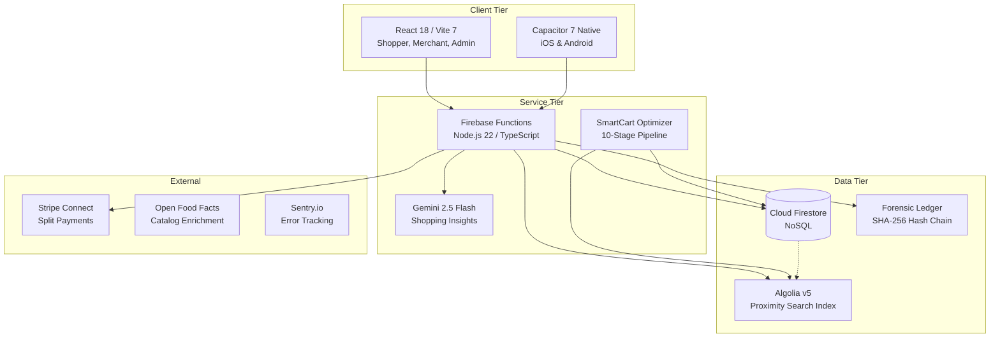

# Spendigo SmartCart — System Architecture

**Last Updated**: 2026-05-01
**Status**: Production-Ready (v1.0)
**Framework**: Turbo Monorepo (React + Node.js 22 + Capacitor 7)

---

## 1. Executive Summary
Spendigo is a high-performance **Marketplace Facilitator** platform built for the Canadian retail ecosystem. The architecture utilizes a **Serverless-First** approach, leveraging client-focused optimization to minimize operating costs while providing millisecond-scale responsiveness.

### Core Pillars:
- **Hybrid Catalog Identity**: Separation of global product data (Master) from local availability (Merchant).
- **Edge Intelligence**: Real-time cart optimization and AI business insights computed at the user-device boundary.
- **Forensic Trust**: Tamper-evident cryptographic logging for all administrative and financial actions.

---

## 2. Platform Architecture (C4 Diagram)

---

## 3. Core System Components

### 3.1 SmartCart Optimization Engine
A 10-stage deterministic pipeline executing entirely in the user's browser.
- **Cost-Efficiency**: Uses **Explicit Search Submission** to minimize Algolia API calls and **Memoized Fuzzy Search** (60s TTL) for rapid local comparisons.
- **Logic**: Filters merchant inventory by proximity (Haversine/FSA), calculates multi-buy/BOGO logic, and analyzes **Dynamic Trip Thresholds** (1.5% basket savings) to decide on store splits.
- **AI Layer**: Integrates with **Gemini 2.5 Flash** to provide natural language insights on "Trip Efficiency" and "Savings Strategies."

### 3.2 Forensic Audit Ledger
A critical compliance layer for Marketplace Facilitators.
- **Security**: Every administrative change (approval, ad priority, commission adjustment) is hashed using SHA-256.
- **Hash Chaining**: Each log entry includes the `prevHash` of the leading block, creating a persistent, immutable chain of custody.
- **Implementation**: See [AUDIT_IMPLEMENTATION.md](./AUDIT_IMPLEMENTATION.md) for technical deep-dive.

### 3.3 Search Architecture (Algolia v5 Hybrid)
- **High-Speed Discovery**: Uses Algolia for fuzzy text and geospatial search (30ms avg response).
- **Precision Resolution**: Falls back to Firestore for exact Barcode/UPC lookups and GTIN normalization (GTIN-8 up to GTIN-14).

### 3.4 Financial Engine (Stripe Connect Standard)
- **Facilitator Model**: Implements **Split-Payment** logic. The platform collects a tiered commission (2%–10% based on subscription) while the merchant receives funds directly into their connected Stripe account.
- **Automated Payouts**: Funds are released to the merchant upon the order reaching `Delivered` status.
- **Forensic Refunds**: Full and partial refunds are reconcilled via `charge.refunded` webhooks and logged to the forensic ledger for dispute protection.

---

## 4. Container & Monorepo Structure
Spendigo utilizes a **Turbo Monorepo** for unified dependency management:
- `apps/web`: React-based UI for all three roles (Shopper/Merchant/Admin).
- `apps/mobile`: Capacitor native wrappers for iOS/Android distribution.
- `services/api`: Firebase Cloud Functions (Node.js 20) for server-side logic.
- `packages/shared`: (Internal) Common types, utilities, and forensic hashing logic.

---

## 5. Security & Governance
| Feature | Implementation | Goal |
| :--- | :--- | :--- |
| **RBAC** | Firestore Security Rules | Granular role enforcement for data access. |
| **Verification** | Firebase Auth + Email Gating | Ensuring valid merchant/shopper identities. |
| **Integrity** | SHA-256 Hashing | Tamper-evident ledger for business actions. |
| **Monitoring** | Sentry SDK | Real-time crash and performance bottleneck tracking. |

---

## 6. Infrastructure & CI/CD
| Service | Role | Provider |
| :--- | :--- | :--- |
| **Hosting** | CDN Delivery | Firebase Hosting |
| **Functions** | Event Handlers | Google Cloud Functions (Node.js 22) |
| **Database** | Real-time Data | Cloud Firestore |
| **Pipeline** | Automated Deploy | GitHub Actions (v4) |

---

**For detailed collection schemas, see**: [SCHEMA.md](./SCHEMA.md)  
**For complete tech stack, see**: [TECH_STACK.md](./TECH_STACK.md)
