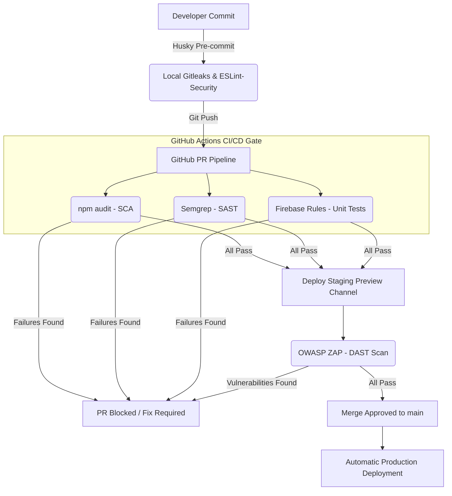
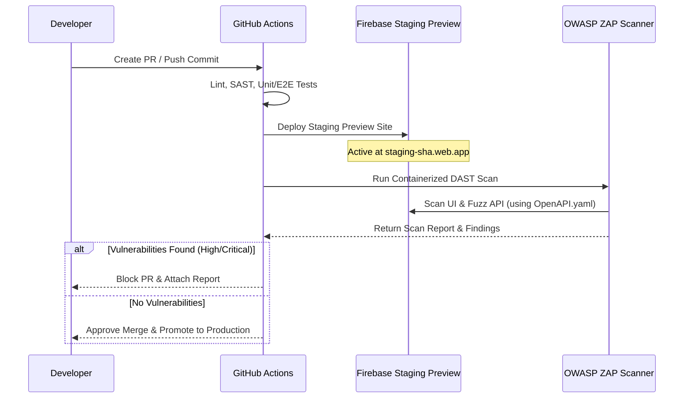

# 🛡️ Spendigo Platform — DevSecOps & Automated Security Testing Roadmap

**Version**: 1.0 (GA Alignment)  
**Date**: 2026-05-25  
**Classification**: CONFIDENTIAL - Internal Development Use Only  

---

## 1. Executive Summary & Strategy Alignment

To support the launch of **Spendigo SmartCart (v1.0 GA)**, this document outlines a comprehensive **DevSecOps** and automated security testing strategy. Following interactive design reviews, we have aligned on an **Active Prevention & Pipeline-Blocking Model**. 

Rather than treating security as an afterthought or running manual audits right before release, Spendigo will integrate automated security gates directly into the **GitHub Actions CI/CD pipeline (`main.yml`)** and **local development workflows (pre-commit)**. The pipeline will strictly **block merges to the `main` branch** upon detection of any `High` or `Critical` severity vulnerabilities.

### 🧭 The Spendigo DevSecOps Blueprint



### Key Security Tooling Selection Matrix

| Vector | Tooling Selection | CI/CD Action | Local Enforcement |
| :--- | :--- | :--- | :--- |
| **Secret Scanning** | **Gitleaks** | ✅ Block PRs | ✅ Husky Pre-Commit Hook |
| **Static Testing (SAST)** | **Semgrep** + ESLint Security | ✅ Block PRs | ✅ IDE linting / Pre-commit |
| **Dependency (SCA)** | **npm audit** + Dependabot | ✅ Block PRs | ✅ Interactive warnings |
| **Dynamic Testing (DAST)** | **OWASP ZAP** (Staging & API) | ✅ Scan Preview Channel | ❌ Manual on-demand |
| **Infrastructure (IaC)** | Firebase **Rules Unit Testing** | ✅ Block PRs (`test:rules`) | ✅ Local vitest suite |

---

## 2. Secret Scanning: Hardening the Repository against Secret Leaks

Spendigo handles sensitive credentials, including Stripe private keys, GCP service accounts, Firebase app credentials, Algolia keys, and Google Gemini API keys. Catching accidental credential commits *before* they are pushed to GitHub is critical.

### 2.1 Local Pre-Commit Gate (Husky & lint-staged)
We will install **Husky** and **lint-staged** to run Gitleaks locally on staged changes. If a developer accidentally leaves a hardcoded key in their code, the git commit is blocked immediately on their machine.

#### Step 1: Install developer tooling
```bash
npm install husky lint-staged --save-dev
npx husky init
```

#### Step 2: Configure pre-commit hook (`.husky/pre-commit`)
```bash
#!/bin/sh
. "$(dirname "$0")/_/husky.sh"

npx lint-staged
gitleaks protect --staged --verbose
```

### 2.2 CI pipeline integration (GitHub Actions)
Add Gitleaks scanning to the GitHub actions job to verify that no commits bypassing local hooks can enter the `main` branch.

```yaml
      - name: Run Gitleaks Secret Scanner
        uses: gitleaks/gitleaks-action@v2
        env:
          GITHUB_TOKEN: ${{ secrets.GITHUB_TOKEN }}
```

### 2.3 Customizing Gitleaks (`.gitleaks.toml`)
Create a custom configuration in the root directory to define custom patterns (e.g., matching custom Spendigo API tokens or specific Firebase service account structures) and ignore specific test environments.

```toml
# .gitleaks.toml
[title]
"Spendigo Custom Secret Scanner Rules"

[[rules]]
description = "Spendigo Custom API Token"
regex = '''spendigo_[a-zA-Z0-9_-]{32,64}'''
tags = ["key", "api", "spendigo"]

[allowlist]
description = "Allow mock Stripe and Firebase IDs in unit tests"
paths = [
  '''tests/rules/.*''',
  '''tests/unit/.*'''
]
```

---

## 3. Static Application Security Testing (SAST): Code Analysis

To prevent vulnerabilities like cross-site scripting (XSS), SQL injection (especially during our Drizzle PostgreSQL transition), insecure cryptographic operations, and serverless injection attacks, we will implement SAST at two layers.

### 3.1 IDE & Local Linting: ESLint Security Plugins
We will extend Spendigo's existing `.eslintrc.cjs` with two powerful security plugins:
1. `eslint-plugin-security`: Identifies dangerous Node.js patterns (e.g., dynamic `eval`, non-literal regular expressions, variable `require` paths).
2. `eslint-plugin-sonarjs`: Identifies complex paths, logical bugs, and cognitive complexity vulnerabilities.

#### Step 1: Install plugins
```bash
npm install eslint-plugin-security eslint-plugin-sonarjs --save-dev
```

#### Step 2: Update `.eslintrc.cjs`
```javascript
module.exports = {
  root: true,
  env: {
    browser: true,
    es2020: true,
    node: true,
  },
  extends: [
    'eslint:recommended',
    'plugin:@typescript-eslint/recommended',
    'plugin:security/recommended',
    'plugin:sonarjs/recommended',
  ],
  ignorePatterns: ['dist', '.eslintrc.cjs', 'node_modules', '**/lib/**'],
  parser: '@typescript-eslint/parser',
  plugins: ['security', 'sonarjs'],
  rules: {
    '@typescript-eslint/no-explicit-any': 'warn',
    'no-unused-vars': 'off',
    '@typescript-eslint/no-unused-vars': ['warn'],
    'security/detect-object-injection': 'off', // Turn off noisy rules as needed
  },
};
```

### 3.2 CI Security Analysis: Semgrep Integration
Semgrep is a fast, open-source static analysis engine that supports TypeScript, Node.js, and React. It operates directly in the CI pipeline without requiring compilation.

Add the following step in `.github/workflows/main.yml`:

```yaml
      - name: Run Semgrep SAST Scan
        run: |
          python3 -m pip install semgrep
          semgrep scan --config auto --error --exclude=dist/ --exclude=node_modules/
```
> [!TIP]
> Setting the `--error` flag guarantees that if Semgrep finds security issues (matching OWASP Top 10 rulesets), it will return a non-zero exit code and block the build.

---

## 4. Software Composition Analysis (SCA): Dependency Protection

Vulnerable third-party npm packages represent one of the highest risk factors for web platforms. Spendigo leverages packages like `pdfkit`, `dotenv`, and Firebase SDKs. We must automate package auditing.

### 4.1 Blocking on Vulnerable Packages in CI
We will add `npm audit` to the pipeline with strict parameters. It will run right after installing dependencies to ensure no unsafe package is deployed.

```yaml
      - name: Audit Dependencies for Security Gaps
        run: npm audit --audit-level=high
```
> [!IMPORTANT]
> The `--audit-level=high` flag ensures that the build only fails on `High` or `Critical` vulnerabilities. This maintains developer velocity by ignoring trivial `Low` or `Moderate` warnings that do not present immediate risks, while providing a solid guardrail for major issues.

### 4.2 Automated Remediations: GitHub Dependabot
Enable Dependabot in the Spendigo repository to automatically scan dependencies daily and open automated Pull Requests containing security patches.

Create a new file `.github/dependabot.yml`:
```yaml
# .github/dependabot.yml
version: 2
updates:
  - package-ecosystem: "npm"
    directory: "/"
    schedule:
      interval: "daily"
    open-pull-requests-limit: 10
    target-branch: "main"
```

---

## 5. Dynamic Application Security Testing (DAST) & API Fuzzing

Dynamic testing (DAST) analyzes the running application to find vulnerabilities that static scanners miss, such as SQL injections in database execution paths, broken server authorization, session fixation, and logical API flaws.

### 5.1 Leverage the PR-based **Firebase Hosting Staging Preview Channel**
Spendigo's CI/CD workflow already builds and deploys a preview web application on every pull request to:
`channelId: staging-${{ github.sha }}`

This provides a real, sandboxed target url perfect for dynamic security scans before the pull request is merged into `main`. We will inject a dynamic scanner execution right after the preview deploy step!



### 5.2 Containerized OWASP ZAP Scan
Using the official ZAP action, we can run a baseline scan against the freshly deployed staging channel, and leverage `docs/OPENAPI.yaml` to perform targeted API fuzzing against the Node.js functions.

```yaml
      - name: Run OWASP ZAP Dynamic Security Scan
        uses: zaproxy/action-baseline@v0.12.0
        with:
          token: ${{ secrets.GITHUB_TOKEN }}
          target: 'https://spendigo-8540c--staging-${{ github.sha }}.web.app'
          rules_file_name: '.zap/rules.tsv'
          cmd_options: '-d' # Detailed logs
```

### 5.3 Automated API Security Testing
To test Spendigo's custom API (including `/smartcartOptimize`, `/inviteTeamMember`, `/refundOrder`, and payment endpoints), we will run a ZAP API scan powered by the existing OpenAPI spec.

```yaml
      - name: Run OWASP ZAP API Security Scan
        uses: zaproxy/action-api-scan@v0.9.0
        with:
          token: ${{ secrets.GITHUB_TOKEN }}
          format: openapi
          target: 'docs/OPENAPI.yaml'
          rules_file_name: '.zap/api-rules.tsv'
```

---

## 6. Addressing the CI/CD Testing Gap: Security Rules Unit Testing

### ⚠️ Current Operational Gap Detected
During our review of the Spendigo workspace, we identified a critical testing gap:
* `package.json` contains a dedicated suite for security rules: `"test:rules": "vitest run -c tests/rules/vitest.rules.config.ts"`.
* This suite validates all custom Firestore security rules, verifying that shoppers cannot modify master catalog data and that merchants are properly sandboxed to their `storeId` records.
* **Crucially, `npm run test:rules` is currently OMITTED from `.github/workflows/main.yml`.** Only standard unit/E2E tests (`npm test` / `vitest`) are running.

### 🛠️ Resolution Action
We must immediately integrate security rules verification into the CI/CD workflow. This ensures that any change modifying `firestore.rules` or `storage.rules` is cryptographically and logically validated by Vitest before code promotion.

We will insert this validation right alongside standard unit testing:
```yaml
      - name: Run Standard Unit Tests
        run: npm test

      - name: Run Security Rules Unit Tests
        run: npm run test:rules
```

---

## 7. Actionable DevSecOps YAML Configuration

Below is the proposed update to `.github/workflows/main.yml` showing exactly how the DevSecOps controls, secret scans, SAST, SCA, rules validation, and DAST integrations fit seamlessly into the existing workflow.

```diff
name: Deploy to Firebase Hosting on merge to main
# Deployment Trigger: 2026-04-26T17:39:18Z

on:
  push:
    branches:
      - main
  pull_request:
    branches:
      - main
  workflow_dispatch:

jobs:
  build_and_deploy:
    runs-on: ubuntu-latest
    env:
      FORCE_JAVASCRIPT_ACTIONS_TO_NODE24: true
    steps:
      - uses: actions/checkout@v4
+       with:
+         fetch-depth: 0 # Essential for Gitleaks push audits

      - name: Setup Node.js
        uses: actions/setup-node@v4
        with:
          node-version: '22'
          cache: 'npm'

      - name: Install Dependencies
        run: npm ci

+     - name: Run Gitleaks Secret Scanner
+       uses: gitleaks/gitleaks-action@v2
+       env:
+         GITHUB_TOKEN: ${{ secrets.GITHUB_TOKEN }}

+     - name: Audit Dependencies (SCA)
+       run: npm audit --audit-level=high

+     - name: Run Semgrep Static Scan (SAST)
+       run: |
+         python3 -m pip install semgrep
+         semgrep scan --config auto --error --exclude=dist/ --exclude=node_modules/

      - name: Lint
        run: npm run lint

      - name: Build
        run: npm run build
        env:
          VITE_FIREBASE_API_KEY: ${{ secrets.VITE_FIREBASE_API_KEY }}
          VITE_FIREBASE_AUTH_DOMAIN: ${{ secrets.VITE_FIREBASE_AUTH_DOMAIN }}
          VITE_FIREBASE_PROJECT_ID: ${{ secrets.VITE_FIREBASE_PROJECT_ID }}
          VITE_FIREBASE_STORAGE_BUCKET: ${{ secrets.VITE_FIREBASE_STORAGE_BUCKET }}
          VITE_FIREBASE_MESSAGING_SENDER_ID: ${{ secrets.VITE_FIREBASE_MESSAGING_SENDER_ID }}
          VITE_FIREBASE_APP_ID: ${{ secrets.VITE_FIREBASE_APP_ID }}
          VITE_ALGOLIA_APP_ID: ${{ secrets.VITE_ALGOLIA_APP_ID }}
          VITE_ALGOLIA_SEARCH_KEY: ${{ secrets.VITE_ALGOLIA_SEARCH_KEY }}
          VITE_ALGOLIA_INDEX_NAME: ${{ secrets.VITE_ALGOLIA_INDEX_NAME }}
          VITE_GEMINI_API_KEY: ${{ secrets.VITE_GEMINI_API_KEY }}
          VITE_FIREBASE_APP_CHECK_KEY: ${{ secrets.VITE_FIREBASE_APP_CHECK_KEY }}
          VITE_SENTRY_DSN: ${{ secrets.VITE_SENTRY_DSN }}
          VITE_STRIPE_PUBLISHABLE_KEY: ${{ secrets.VITE_STRIPE_PUBLISHABLE_KEY }}
          VITE_FIREBASE_VAPID_KEY: ${{ secrets.VITE_FIREBASE_VAPID_KEY }}

      - name: Run Tests
        run: npm test

+     - name: Run Security Rules Unit Tests
+       run: npm run test:rules

      - name: E2E Tests
        run: |
          npx playwright install --with-deps chromium
          npx serve apps/web/dist -l 3000 --single &
          sleep 3
          npm run test:e2e
        env:
          PLAYWRIGHT_BASE_URL: http://localhost:3000
          SPENDIGO_TEST_EMAIL: ${{ secrets.SPENDIGO_TEST_EMAIL }}
          SPENDIGO_TEST_PASSWORD: ${{ secrets.SPENDIGO_TEST_PASSWORD }}

      - name: Deploy to Firebase Hosting (live)
        if: github.event_name == 'push'
        uses: FirebaseExtended/action-hosting-deploy@v0
        with:
          repoToken: '${{ secrets.GITHUB_TOKEN }}'
          firebaseServiceAccount: '${{ secrets.FIREBASE_SERVICE_ACCOUNT_SPENDIGO_8540C }}'
          channelId: live
          projectId: spendigo-8540c

      - name: Deploy to Firebase Hosting (staging preview)
        if: github.event_name == 'pull_request'
        id: deploy_staging
        uses: FirebaseExtended/action-hosting-deploy@v0
        with:
          repoToken: '${{ secrets.GITHUB_TOKEN }}'
          firebaseServiceAccount: '${{ secrets.FIREBASE_SERVICE_ACCOUNT_SPENDIGO_8540C }}'
          channelId: staging-${{ github.sha }}
          projectId: spendigo-8540c

+     - name: Run OWASP ZAP DAST Security Scan
+       if: github.event_name == 'pull_request'
+       uses: zaproxy/action-baseline@v0.12.0
+       with:
+         token: ${{ secrets.GITHUB_TOKEN }}
+         target: 'https://spendigo-8540c--staging-${{ github.sha }}.web.app'
+         cmd_options: '-d'
+
+     - name: Run OWASP ZAP API Security Scan
+       if: github.event_name == 'pull_request'
+       uses: zaproxy/action-api-scan@v0.9.0
+       with:
+         token: ${{ secrets.GITHUB_TOKEN }}
+         format: openapi
+         target: 'docs/OPENAPI.yaml'

      - name: Deploy to Firebase (Functions, Firestore, Storage)
        if: github.event_name == 'push'
        uses: w9jds/firebase-action@v15.8.0
        with:
          args: deploy --only functions,firestore,storage --project spendigo-8540c
        env:
          GCP_SA_KEY: ${{ secrets.FIREBASE_SERVICE_ACCOUNT_SPENDIGO_8540C }}
```

---

## 8. Action & Rollout Plan

To ensure a smooth integration without disrupting daily feature development, the DevSecOps rollout is structured in three progressive stages:

### Phase 1: Local & Static Security Guardrails (Week 1)
1. Install and configure **ESLint Security and SonarJS Plugins** locally to get IDE feedback.
2. Initialize **Husky & lint-staged** with **Gitleaks** pre-commit hooks to block hardcoded keys locally.
3. Incorporate `npm run test:rules` to the Pull Request workflow to solve the current CI validation gap.

### Phase 2: High-Severity CI Gates (Week 2)
1. Add `npm audit --audit-level=high` to GitHub Actions to prevent deploying high-severity vulnerable packages.
2. Integrate **Semgrep** and **Gitleaks** checks in `.github/workflows/main.yml` blocking on failures.
3. Configure **GitHub Dependabot** to receive automated dependency upgrades.

### Phase 3: Dynamic Verification & API Fuzzing (Week 3)
1. Configure and launch **OWASP ZAP Baseline Scan** against the deployed Firebase Preview Hosting Channel on pull requests.
2. Launch **ZAP API Scan** integrating `docs/OPENAPI.yaml` to dynamically fuzz serverless cloud functions.
3. Periodically tune Gitleaks, ESLint, and ZAP rule tables to filter out benign platform warnings.
