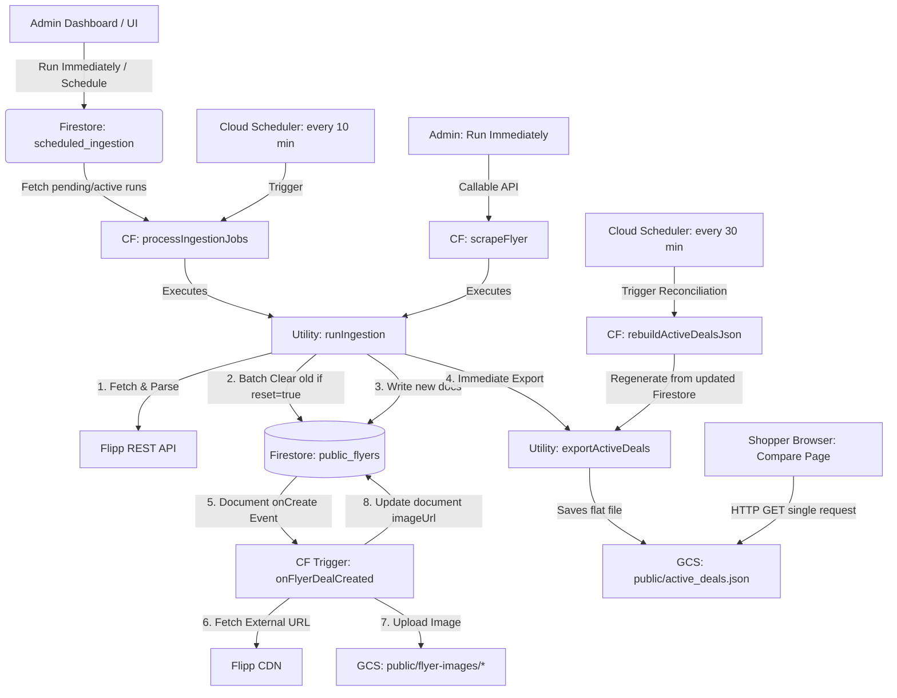

# Public Flyer Ingestion & Image Localization Subsystem

This document provides a comprehensive technical overview of the **Public Flyer Ingestion** subsystem. This subsystem is responsible for scraping weekly grocery flyers and item deals from Flipp's API, persisting them in Firestore, localizing external image assets to Google Cloud Storage to avoid hotlinking/dependency risks, and compiling a highly optimized flat-file cache (`active_deals.json`) to serve shopper search and price comparison tools with **zero Firestore read costs**.

---

## 1. System Architecture

The subsystem operates as a decoupled, event-driven pipeline of Cloud Functions, Firestore triggers, and scheduled jobs:



---

## 2. Ingestion Core Components

### 2.1 API Callables & Cron Triggers

*   **`scrapeFlyer`** (`services/api/src/admin/scrapeFlyer.ts`)
    *   **Type:** HTTPS Callable Function (Admin Role Required)
    *   **Purpose:** Triggers immediate, synchronous scraping and database ingestion for a given postal code.
    *   **Input parameters:** `{ postalCode: string, resetData: boolean }`
*   **`processIngestionJobs`** (`services/api/src/admin/processIngestionJobs.ts`)
    *   **Type:** Scheduled Pub/Sub Function (`every 10 minutes`)
    *   **Purpose:** Monitors the `scheduled_ingestion` collection. It automatically dequeues and executes pending one-time jobs and active recurring jobs due for execution, keeping grocery deals up to date without manual intervention.

### 2.2 Scraper Core

*   **`runIngestion`** (`services/api/src/utils/flippScraper.ts`)
    *   **Purpose:** Orchestrates the entire scraping flow.
    *   **Step-by-step logic:**
        1. Cleans the target postal code (removes whitespace, capitalizes).
        2. If `resetData` is `true`, runs `clearFlyerData` to recursively delete all documents in `public_flyers` and their subcollections (performing batched deletes of 400 at a time).
        3. Queries the Flipp Search API using a generated session ID (`sid`) to find all flyers active in the postal code region.
        4. Filters flyers to include only those matching retailers specified in the `Groceries` category configuration.
        5. For each valid flyer, queries Flipp's flyer item details API to extract all individual deals.
        6. Writes the flyer document to `public_flyers/{flyerId}` and its deals to `public_flyers/{flyerId}/deals/{dealId}` using batched writes of 400.
        7. Calls `exportActiveDeals()` to immediately publish the flat-file cache to Google Cloud Storage.

---

## 3. Database Schemas

### 3.1 `public_flyers` (Root Collection)
Represents an active retail store flyer in a specific geographic location.

| Field Name | Type | Description |
| :--- | :--- | :--- |
| `id` | `string` | Unique identifier (Flipp flyer ID). |
| `title` | `string` | Title of the flyer (e.g., "Weekly Savings"). |
| `retailer` | `string` | Store name (e.g., "No Frills", "Walmart"). |
| `validFrom` | `string` | Start date formatted as `YYYY-MM-DD`. |
| `validTo` | `string` | End date formatted as `YYYY-MM-DD`. |
| `pages` | `number` | Total pages in the physical flyer. |
| `dealsCount`| `number` | Number of scraped deal items. |
| `postalCode`| `string` | Normalized postal code of the scraping location. |
| `ingestedAt`| `Timestamp`| Server timestamp of when the flyer was ingested. |

### 3.2 `deals` (Subcollection: `public_flyers/{flyerId}/deals`)
Represents an individual item offer in a flyer.

| Field Name | Type | Description |
| :--- | :--- | :--- |
| `id` | `string` | Unique identifier of the deal item. |
| `flyerId` | `string` | Parent flyer reference ID. |
| `retailer` | `string` | Retailer name. |
| `category` | `string` | Target category (defaults to `Groceries`). |
| `name` | `string` | Product title (e.g., "Bananas"). |
| `description`| `string` \| `null`| Detailed package size, weight, or constraints. |
| `brand` | `string` \| `null`| Brand name of the product. |
| `currentPrice`| `number` \| `null`| Current discounted offer price. |
| `originalPrice`| `number` \| `null`| Original non-discounted price. |
| `priceText` | `string` \| `null`| Original price format text (e.g., "$3.99/ea"). |
| `imageUrl` | `string` \| `null`| **Localized Firebase Storage download URL** (or external URL before trigger executes). |
| `originalImageUrl`| `string` \| `null`| Preserved external Flipp CDN image URL. |
| `mirroredAt`| `Timestamp` \| `null`| Timestamp when the image was successfully saved to Cloud Storage. |
| `ingestedAt`| `Timestamp`| Server timestamp when the deal was written. |

### 3.3 `scheduled_ingestion` (Root Collection)
Represents scheduled manual or recurring ingestion jobs.

| Field Name | Type | Description |
| :--- | :--- | :--- |
| `postalCode`| `string` | Target postal code. |
| `type` | `string` | `one-time` or `recurring`. |
| `days` | `number[]` \| `null` | Days of week (0 = Sunday ... 6 = Saturday) for recurring cron. |
| `time` | `string` | Time in `HH:MM` format. |
| `scheduledAt`| `number` | Unix timestamp of run time (for `one-time` jobs). |
| `status` | `string` | `pending`, `processing`, `completed`, `failed` or `active`. |
| `shouldReset`| `boolean` | If true, wipes out old flyers and deals before writing. |
| `lastRunAt` | `Timestamp` \| `null`| Timestamp of the last successful execution. |

---

## 4. Image Localization & Mirroring Subsystem

To guarantee fast image loads, circumvent Flipp CDN rate-limiting, and avoid hotlinking errors on client applications, the system includes a dedicated background mirroring trigger:

### 4.1 `onFlyerDealCreated` Trigger
*   **Path:** `services/api/src/triggers/flyerImageMirror.ts`
*   **Type:** Firestore Trigger (`onCreate` of `public_flyers/{flyerId}/deals/{dealId}`)
*   **Trigger Logic:**
    1. Reads the `imageUrl` of the newly created deal document.
    2. Verifies if the URL is external using `isExternalFlyerUrl()` (evaluates `url.startsWith('http')` and checks that it is not already stored inside the Spendigo Firebase Storage bucket).
    3. Generates a unique, deterministic storage path based on the MD5 hash of the original URL:
       `public/flyer-images/${md5(imageUrl)}.${ext}`
    4. Downloads the image array buffer using the internal fetch module.
    5. Saves the buffer to Firebase Storage under the folder `public/flyer-images/` setting high-performance cache controls (`public, max-age=31536000`).
    6. Updates the deal document in Firestore:
        *   Rewrites `imageUrl` to the localized Firebase Storage download URL.
        *   Saves the original Flipp CDN URL to `originalImageUrl`.
        *   Sets a server timestamp to `mirroredAt`.

---

## 5. Flat-File Cache Sync & Race Condition Rebuilder

### 5.1 GCS Cache serving
To keep shopper queries blazing fast and eliminate heavy Firestore collection read charges, the client Compare page (`PriceCompare.tsx`) **never** queries the `public_flyers` Firestore collection directly. Instead, it downloads a single optimized JSON document, `active_deals.json`, directly from Spendigo's Firebase Cloud Storage bucket.

### 5.2 The Race Condition & Solution
Because the Image Mirroring Trigger operates asynchronously in the background:
1. `runIngestion` completes writing deals and immediately calls `exportActiveDeals()`.
2. At this exact microsecond, the background `onFlyerDealCreated` trigger has not yet executed.
3. Therefore, the initial `active_deals.json` is exported containing the external Flipp CDN URLs instead of the localized Firebase Storage ones.

#### Resolution: `rebuildActiveDealsJson` Job
To resolve this, a scheduled Pub/Sub function (`services/api/src/admin/rebuildActiveDealsJson.ts`) runs **every 30 minutes**. 
This scheduled task scans Firestore (which by then has had its `imageUrl` properties updated to localized URLs by the background triggers) and overwrites the flat-file `active_deals.json` cache in GCS.

> [!TIP]
> After triggering a manual ingestion with `resetData: true`, you can manually invoke `exportActiveDeals()` programmatically via a script or command to force an immediate rebuild of the flat-file cache with the localized images without waiting for the 30-minute cron cycle.

---

## 6. Operational Guidelines

### How to trigger a manual, immediate rebuild of the flat-file GCS cache
You can run this quick administrative node script on the server to immediately compile and upload the `active_deals.json` cache with 100% localized URLs:

```javascript
const admin = require('firebase-admin');
admin.initializeApp({
  projectId: 'spendigo-8540c',
  storageBucket: 'spendigo-8540c.firebasestorage.app'
});

const { exportActiveDeals } = require('./lib/utils/exportActiveDeals');

async function run() {
  console.log('Rebuilding active_deals.json from Firestore now...');
  await exportActiveDeals();
  console.log('Successfully rebuilt active_deals.json with localized image URLs!');
}

run().catch(console.error);
```
