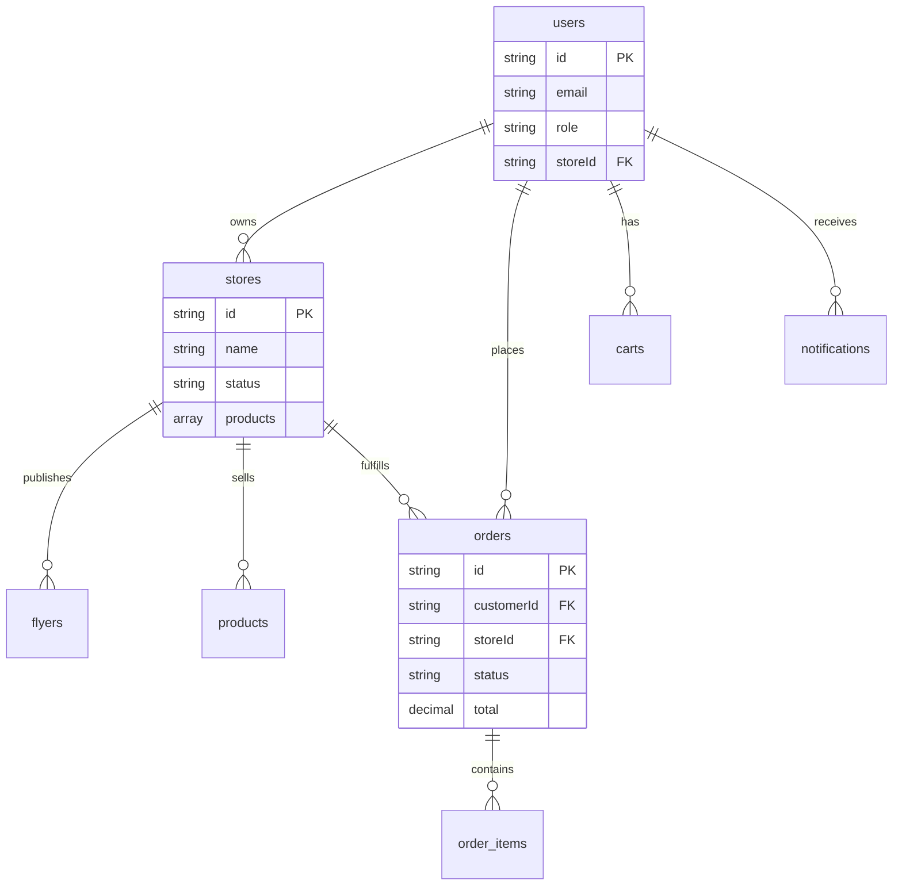

# Spendigo SmartCart — Database Schema

**Last Updated**: 2025-12-24  
**Database**: Cloud Firestore (NoSQL)  
**Status**: Production Implementation

---

## 1. Overview

Spendigo uses **Cloud Firestore**, a NoSQL document database, instead of the originally planned PostgreSQL. This document describes the actual collection structure and data models as implemented.

---

## 2. Collection Structure

### 2.1 Top-Level Collections

```
/users                  # User profiles and authentication
/stores                 # Merchant store data
/orders                 # Order documents
/catalog                # Master product catalog
/audit_logs             # Security audit ledger
/notifications          # User notifications
/carts                  # Shopping carts
/wishlists              # User wishlists
/settings               # Platform-wide settings
```

### 2.2 Subcollections

```
/stores/{storeId}/flyers/{flyerId}   # Digital flyers for each store
```

---

## 3. Document Schemas (TypeScript Interfaces)

### 3.1 Users Collection (`/users/{userId}`)

```typescript
interface User {
  id: string;                    // Firebase Auth UID
  email: string;
  name: string;
  role: 'consumer' | 'merchant' | 'admin';
  avatar?: string;
  
  // Merchant-specific fields
  storeId?: string;              // Reference to stores collection
  storeName?: string;
  merchantRole?: 'OWNER' | 'MANAGER' | 'STAFF' | 'MARKETING';
  subscriptionTier?: 'free' | 'core' | 'growth';
  
  // Admin-specific fields
  adminRole?: 'SUPER_ADMIN' | 'SUPPORT' | 'MODERATOR' | 'AUDITOR';
}
```

**Indexes**: None required (Firebase Auth UID is primary key)

---

### 3.2 Stores Collection (`/stores/{storeId}`)

```typescript
interface Store {
  id: string;
  name: string;
  merchantEmail: string;
  location: string;
  province: 'ON' | 'QC' | 'BC' | 'AB' | 'MB' | 'SK' | 'NB' | 'NS' | 'PE' | 'NL' | 'NT' | 'YT' | 'NU';
  status: 'active' | 'pending' | 'suspended';
  
  // Products
  products: Product[];           // Denormalized for fast reads
  
  // Active flyer metadata
  flyer?: {
    title: string;
    image: string;
    validUntil: string;          // ISO date
  };
  
  // Settings
  subscriptionTier: 'free' | 'core' | 'growth';
  deliveryEnabled: boolean;
  pickupEnabled: boolean;
  operatingHours?: string;
  
  // Metadata
  joinedAt: string;              // ISO date
}

interface Product {
  id: string;
  name: string;
  price: number;
  category: string;
  image?: string;
  stock?: number;
  isTaxable?: boolean;           // For HST calculation
}
```

**Indexes**: 
- `status` (for admin queries)
- `province` (for tax calculation)

---

### 3.3 Orders Collection (`/orders/{orderId}`)

```typescript
interface Order {
  id: string;                    // Auto-generated doc ID
  date: string;                  // ISO timestamp
  status: 'placed' | 'preparing' | 'out_for_delivery' | 'delivered' | 'cancelled';
  
  // Parties
  customerId: string;            // User ID
  customerName: string;
  storeId: string;               // Store ID
  storeName: string;
  
  // Items
  items: OrderItem[];
  
  // Financials
  subtotal: number;
  tax: number;
  deliveryFee: number;
  total: number;
  
  // Payment
  paymentMethod: 'card' | 'in_store';
  paymentStatus: 'paid' | 'pending';
  paymentCollectedBy?: {         // Audit trail for in-store payments
    id: string;
    name: string;
    timestamp: string;
  };
  
  // Delivery
  deliveryAddress?: Address;
  estimatedDelivery?: string;
  
  // Metadata
  createdAt: FirebaseTimestamp;
}

interface OrderItem {
  productId: string;
  productName: string;
  price: number;
  quantity: number;
  image?: string;
}

interface Address {
  id: string;
  label: string;
  street: string;
  city: string;
  province: string;
  postalCode: string;
  isDefault: boolean;
}
```

**Indexes**:
- `customerId` (for consumer order history)
- `storeId` (for merchant order inbox)
- `status` (for Kanban board filtering)
- Composite: `storeId + status` (for merchant dashboard)

---

### 3.4 Catalog Collection (`/catalog/{productId}`)

```typescript
interface CatalogProduct {
  id: string;
  name: string;
  description: string;
  category: string;
  image: string;
  basePrice: number;             // Suggested retail price
  isTaxable: boolean;
  tags?: string[];
}
```

**Purpose**: Master product database. Merchants add products from here with custom pricing.

---

### 3.5 Audit Logs Collection (`/audit_logs/{logId}`)

```typescript
interface AuditLog {
  id: string;                    // Custom ID: txn_{timestamp}_{random}
  timestamp: string;             // ISO timestamp
  
  actor: {
    id: string;                  // User ID
    email: string;
    ip: string;                  // Simulated in dev
  };
  
  action: string;                // e.g., 'AUTH_LOGIN', 'STORE_STATUS_UPDATE', 'ORDER_CREATE'
  resource?: string;             // e.g., 'store/1', 'order/abc123'
  metadata?: Record<string, any>;
  
  // Blockchain-lite hash chain
  prevHash: string;              // SHA-256 hash of previous log
  hash: string;                  // SHA-256 hash of this log
}
```

**Security**: Append-only. Hash chain ensures tamper-evidence.

---

### 3.6 Flyers Subcollection (`/stores/{storeId}/flyers/{flyerId}`)

```typescript
interface Flyer {
  id: string;
  title: string;
  image: string;                 // Cover image URL
  validFrom: string;             // ISO date
  validUntil: string;            // ISO date
  status: 'draft' | 'scheduled' | 'active' | 'expired';
  
  products: FlyerProduct[];
}

interface FlyerProduct {
  productId: string;
  productName: string;
  originalPrice: number;
  salePrice: number;
  discountPercent: number;
}
```

**Lifecycle**: Draft → Scheduled → Active → Expired

---

### 3.7 Notifications Collection (`/notifications/{userId}`)

```typescript
interface NotificationDocument {
  userId: string;                // User or Store ID
  notifications: AppNotification[];
}

interface AppNotification {
  id: string;
  type: 'order' | 'system' | 'promotion';
  title: string;
  message: string;
  timestamp: string;
  isRead: boolean;
  link?: string;                 // Navigation target
}
```

---

### 3.8 Carts Collection (`/carts/{userId}`)

```typescript
interface Cart {
  userId: string;
  items: CartItem[];
  lastUpdated: FirebaseTimestamp;
}

interface CartItem {
  productId: string;
  productName: string;
  storeId: string;
  storeName: string;
  price: number;
  quantity: number;
  image?: string;
}
```

**Hybrid Persistence**: 
- Guest users → LocalStorage
- Authenticated users → Firestore (synced on login)

---

### 3.9 Settings Collection (`/settings/platform`)

```typescript
interface PlatformSettings {
  maintenanceMode: boolean;
  maintenanceMessage?: string;
  
  // Dual-approval system for maintenance mode
  maintenancePending?: {
    requestedBy: string;
    requestedAt: string;
    approvedBy?: string;
    approvedAt?: string;
  };
}
```

---

## 4. Security Rules (Firestore Rules)

**Current Status**: Development mode (relaxed rules)

**Production Rules** (to be implemented):

```javascript
rules_version = '2';
service cloud.firestore {
  match /databases/{database}/documents {
    
    // Users: Read own, write own
    match /users/{userId} {
      allow read: if request.auth.uid == userId;
      allow write: if request.auth.uid == userId;
    }
    
    // Stores: Public read, owner write
    match /stores/{storeId} {
      allow read: if true;
      allow write: if request.auth.token.storeId == storeId;
    }
    
    // Orders: Consumer read own, Merchant read own store
    match /orders/{orderId} {
      allow read: if request.auth.uid == resource.data.customerId
                  || request.auth.token.storeId == resource.data.storeId;
      allow create: if request.auth.uid != null;
      allow update: if request.auth.token.storeId == resource.data.storeId;
    }
    
    // Catalog: Public read, admin write
    match /catalog/{productId} {
      allow read: if true;
      allow write: if request.auth.token.role == 'admin';
    }
    
    // Audit Logs: Append-only
    match /audit_logs/{logId} {
      allow read: if request.auth.token.role == 'admin';
      allow create: if request.auth.uid != null;
      allow update, delete: if false;  // Immutable
    }
  }
}
```

---

## 5. Data Relationships (Visual)



---

## 6. Migration from Original Schema

The original plan used **PostgreSQL** with relational tables. The current implementation uses **Firestore** for:
- **Real-time sync**: Orders update instantly without polling
- **Easier scaling**: Auto-scales without server management
- **Faster development**: No ORM setup, migrations, or server config

**Trade-offs**:
- ❌ No JOIN operations (denormalization required)
- ❌ No ACID transactions across collections (use batch writes)
- ✅ Real-time listeners
- ✅ Offline persistence
- ✅ Auto-scaling

---

## 7. Query Patterns

### Common Queries

```typescript
// Get consumer's orders
const ordersQuery = query(
  collection(db, 'orders'),
  where('customerId', '==', userId),
  orderBy('date', 'desc')
);

// Get merchant's orders by status
const merchantOrdersQuery = query(
  collection(db, 'orders'),
  where('storeId', '==', storeId),
  where('status', '==', 'placed')
);

// Get active flyers for a store
const flyersQuery = query(
  collection(db, `stores/${storeId}/flyers`),
  where('status', '==', 'active')
);
```

**Composite Indexes Required**:
- `storeId + status`
- `customerId + date`

---

## 8. Backup & Recovery

**Firebase Built-in**:
- Automatic daily backups (14-day retention)
- Point-in-time recovery available

**Manual Export**:
```bash
gcloud firestore export gs://[BUCKET_NAME]
```

---

**For architecture overview, see**: [ARCHITECTURE.md](./ARCHITECTURE.md)  
**For complete tech stack, see**: [TECH_STACK.md](./TECH_STACK.md)
