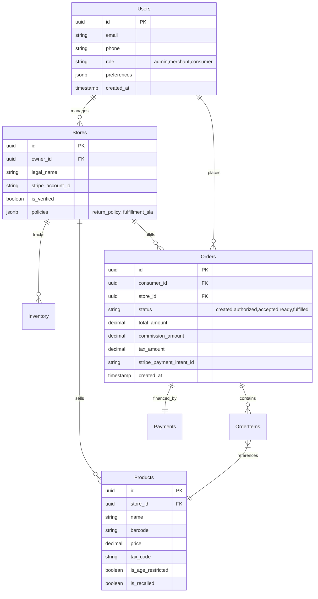

# Spendigo SmartCart — Database Schema (PostgreSQL)

## 1. Entity Relationship Diagram


## 2. Table Definitions (SQL)

### 2.1 Users & Auth
```sql
CREATE TYPE user_role AS ENUM ('admin', 'merchant', 'consumer');

CREATE TABLE users (
    id UUID PRIMARY KEY DEFAULT gen_random_uuid(),
    email VARCHAR(255) UNIQUE NOT NULL,
    phone VARCHAR(20),
    role user_role DEFAULT 'consumer',
    is_banned BOOLEAN DEFAULT false,
    created_at TIMESTAMP WITH TIME ZONE DEFAULT NOW(),
    updated_at TIMESTAMP WITH TIME ZONE DEFAULT NOW()
);
```

### 2.2 Marketplace Core (Stores)
```sql
CREATE TABLE stores (
    id UUID PRIMARY KEY DEFAULT gen_random_uuid(),
    owner_id UUID REFERENCES users(id) NOT NULL,
    legal_name VARCHAR(255) NOT NULL,
    display_name VARCHAR(255) NOT NULL,
    stripe_account_id VARCHAR(255) UNIQUE, -- Stripe Connect Express/Custom ID
    is_live BOOLEAN DEFAULT false,
    is_verified BOOLEAN DEFAULT false,
    commission_rate DECIMAL(5,4) DEFAULT 0.0500, -- 5% default
    address_json JSONB NOT NULL, -- Full address for invoices
    created_at TIMESTAMP WITH TIME ZONE DEFAULT NOW()
);
```

### 2.3 Catalog & Inventory
```sql
CREATE TABLE products (
    id UUID PRIMARY KEY DEFAULT gen_random_uuid(),
    store_id UUID REFERENCES stores(id) NOT NULL,
    name VARCHAR(255) NOT NULL,
    description TEXT,
    barcode VARCHAR(100), -- UPC/EAN
    price_cents INTEGER NOT NULL,
    unit VARCHAR(50), -- e.g., 'kg', 'each'
    tax_code VARCHAR(50) DEFAULT 'txcd_00000000', -- Stripe Tax Code
    is_age_restricted BOOLEAN DEFAULT false,
    image_url TEXT,
    created_at TIMESTAMP WITH TIME ZONE DEFAULT NOW()
);

CREATE TABLE inventory (
    product_id UUID REFERENCES products(id) PRIMARY KEY,
    quantity INTEGER DEFAULT 0,
    low_stock_threshold INTEGER DEFAULT 5,
    updated_at TIMESTAMP WITH TIME ZONE DEFAULT NOW()
);
```

### 2.4 Orders & Listings
```sql
CREATE TYPE order_status AS ENUM (
    'created', 'authorized', 'accepted', 'ready', 'fulfilled', 'cancelled', 'refunded'
);

CREATE TABLE orders (
    id UUID PRIMARY KEY DEFAULT gen_random_uuid(),
    store_id UUID REFERENCES stores(id) NOT NULL,
    consumer_id UUID REFERENCES users(id) NOT NULL,
    
    -- Financials
    subtotal_cents INTEGER NOT NULL,
    tax_cents INTEGER NOT NULL,
    commission_cents INTEGER NOT NULL, -- Platform Fee
    total_cents INTEGER NOT NULL,
    
    status order_status DEFAULT 'created',
    stripe_payment_intent_id VARCHAR(255),
    stripe_transfer_id VARCHAR(255),
    
    metadata JSONB, -- Snapshots of prices/tax rules at time of order
    created_at TIMESTAMP WITH TIME ZONE DEFAULT NOW()
);

CREATE TABLE order_items (
    id UUID PRIMARY KEY DEFAULT gen_random_uuid(),
    order_id UUID REFERENCES orders(id) NOT NULL,
    product_id UUID REFERENCES products(id) NOT NULL,
    quantity INTEGER NOT NULL,
    price_at_purchase_cents INTEGER NOT NULL,
    total_cents INTEGER NOT NULL
);

### 2.5 Flyers & Deals (Phase 2)
```sql
CREATE TABLE flyers (
    id UUID PRIMARY KEY DEFAULT gen_random_uuid(),
    store_id UUID REFERENCES stores(id) NOT NULL,
    status VARCHAR(50) DEFAULT 'processing', -- processing, review_required, active, expired
    active_from TIMESTAMP WITH TIME ZONE NOT NULL,
    active_until TIMESTAMP WITH TIME ZONE NOT NULL,
    created_at TIMESTAMP WITH TIME ZONE DEFAULT NOW()
);

CREATE TABLE flyer_pages (
    id UUID PRIMARY KEY DEFAULT gen_random_uuid(),
    flyer_id UUID REFERENCES flyers(id) NOT NULL,
    page_number INTEGER NOT NULL,
    image_url TEXT NOT NULL,
    ocr_raw_text TEXT,
    created_at TIMESTAMP WITH TIME ZONE DEFAULT NOW()
);

CREATE TABLE extracted_deals (
    id UUID PRIMARY KEY DEFAULT gen_random_uuid(),
    flyer_id UUID REFERENCES flyers(id) NOT NULL,
    page_id UUID REFERENCES flyer_pages(id) NOT NULL,
    
    product_name VARCHAR(255) NOT NULL,
    price_cents INTEGER,
    unit VARCHAR(50), 
    
    bbox_json JSONB, -- Coordinates on the image {x,y,w,h}
    confidence_score DECIMAL(4,3), -- 0.000 to 1.000
    is_verified BOOLEAN DEFAULT false,
    
    created_at TIMESTAMP WITH TIME ZONE DEFAULT NOW()
);
```
```

## 3. RLS (Row Level Security) Policies
*Strict enforcement required.*

- **Users**: Users can read/edit their own record.
- **Stores**: Public read. Owner write.
- **Products**: Public read (if store is live). Store owner write.
- **Orders**: Consumer read (own), Store owner read (own). No public access.
