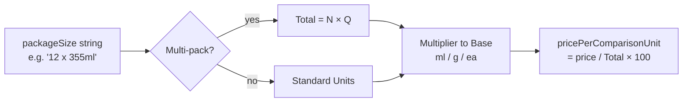
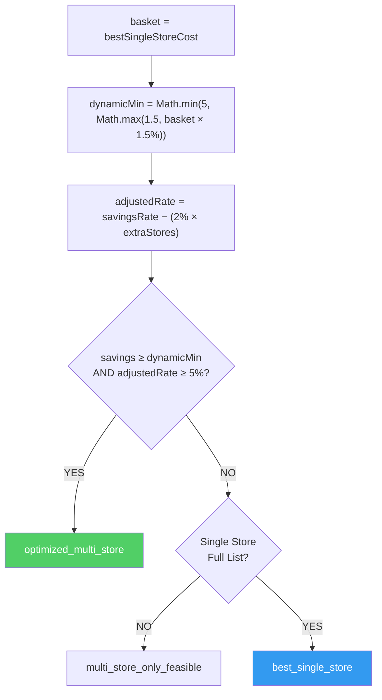

# SmartCart Algorithm Flow

**Last Updated**: 2026-04-20
**Status**: Production-Ready (v1.0)

---

## Full Pipeline

```mermaid
flowchart TD
    A([Shopper opens SmartCart]) --> B

    subgraph LOAD["① Data Loading — real-time Firestore"]
        B[onSnapshot: merchant_products\nwhere available_quantity > 0] --> C
        C[onSnapshot: stores/{id}/deals\nfor each active store] --> D
        D[getDocs: price_history\nfor context-matched items]
    end

    D --> E

    subgraph ENRICH["② Price Enrichment — getEffectivePrice()"]
        E[Check deal hierarchy per item] --> E1
        E1{Flash Sale\nactive?} -->|yes| E2[Apply BOGO / multi-buy\nor flash price]
        E1 -->|no| E3{Flyer Item / \nStandard Sale?}
        E3 -->|yes| E4[Apply salePrice\nor discount rate]
        E3 -->|no| E5[Use regular price]
        E2 & E4 & E5 --> E6[isExpired check:\n30-day default expiry\nif no dates set]
    end

    E6 --> F

    subgraph AVAIL["③ Availability Map — useMemo"]
        F[Filter by Reach] --> F1
        F1[Distance: Haversine ≤ radius\nOR same FSA prefix] --> F2
        F2[calculateUnitPrice\nNormalizing per 100g / 100ml / 1ea] --> F3
        F3[availabilityMap\nmaster_id → merchant_offers]
    end

    F3 --> G

    subgraph MATCH["④ Wishlist Matching — useOptimizedWishlist"]
        G[Map wishlist items] --> G1
        G1{Direct ID\nMatch?} -->|yes| G2[Strong match\nexact options]
        G1 -->|no, generic| G3[Fuzzy search\nLevenshtein + Token\nscore ≥ 65]
        G2 & G3 --> G4[Attach quantityWarning\nand bulkSavingHint]
    end

    G4 --> H

    subgraph SUBS["⑤ Substitutions — getSubstitutionSuggestions"]
        H[Scan for group alternatives] --> H1
        H1{Group ID\nexists?} -->|yes| H2[cheaper group members\nin availabilityMap]
        H1 -->|no| H3[Fuzzy search\nsame category, score ≥ 70]
        H2 & H3 --> H4[Top 3 savings results]
    end

    H4 --> I

    subgraph MATRIX["⑥ Price Matrix — buildSmartCartPriceMatrix"]
        I[Build N x M grid] --> I1
        I1[Cell Logic:\nlower unit_price wins\ncomparable items only]
    end

    I1 --> J

    subgraph OPT["⑦ Optimizer — optimizeSmartCart"]
        J[Greedy per-item selection] --> J1
        J1[Sort by:\nUnitPrice → Price → Distance] --> J2
        J2{Preferred\nStore?} -->|yes| J3[Switch if within 2%\nof global minimum]
        J2 -->|no| J4[Assign cheapest]
    end

    J4 --> K

    subgraph SIM["⑧ Single-Store Simulation — simulateSingleStoreCart"]
        K[Evaluate N stores individually] --> K1
        K1[missing_items penalty\n= average market price] --> K2
        K2[totalWithDelivery\n= basket + deliveryFee]
    end

    K2 --> L

    subgraph COMPARE["⑨ Comparison — analyzeTripConsolidation"]
        L[dynamicMin = clamp\nbasket × 1.5%, $1.50, $5.00] --> L1
        L1[adjustedRate = savingsRate\n- 2% × extra_stores] --> L2
        L2{Is extra trip\nworth it?}
        L2 -->|yes| L3[recommendation:\noptimized_multi_store]
        L2 -->|no| L4[recommendation:\nbest_single_store]
    end

    L3 & L4 --> M

    subgraph AI["⑩ AI Smarts — useSmartInsights (Gemini 2.5)"]
        M[Debounced Payload Sync] --> M1
        M1[Gemini 2.5 Flash Prompting] --> M2
        M2[Generate 2-3 High-Impact\nTrip Efficiency Insights]
    end

    M2 --> N

    subgraph OUT["⑪ UI Dispatch"]
        N[optimizerItems\nSelections / matrix\ntripAnalysis / AI insights]
    end
```

---

## Price Normalization Detail



---

## Trip Decision Logic (Phase 2 Thresholds)



---

## Pipeline Metadata

| Stage | Logic Component | Implementation File |
|-------|-----------------|---------------------|
| **Data** | Firestore Snapshots | `useOptimizedWishlist.ts` |
| **Logic** | Matching / Routing | `useOptimizedWishlist.ts` |
| **Normalizer** | Unit Price Parity | `priceNormalization.ts` |
| **Optimizer** | Greedy Min-Max | `smartcart_optimizer.ts` |
| **Comparison** | Single-Store Baseline | `smartcart_comparison_engine.ts` |
| **Trip Engine** | Dynamic Gatekeeping | `analyzeTripConsolidation.ts` |
| **AI** | Gemini 2.5 Flash | `useSmartInsights.ts` |
| **Search** | Levenshtein / Token | `fuzzy-search.ts` |
