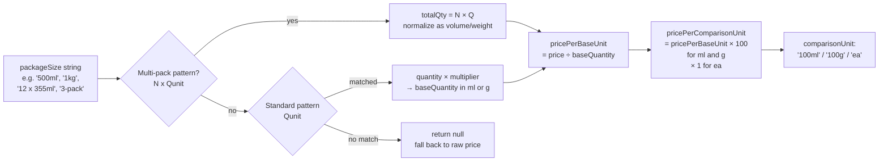
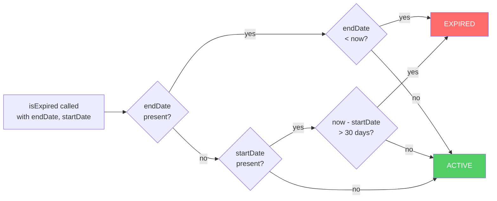
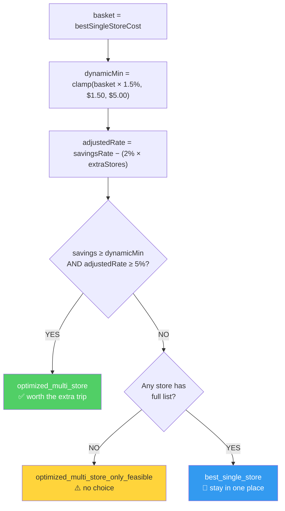

# SmartCart Algorithm Flow

> Generated from source code — not from prior documentation.
> Files: `useOptimizedWishlist.ts`, `smartcart_optimizer.ts`, `optimizeCart.ts`,
> `buildPriceMatrix.ts`, `priceNormalization.ts`, `buildSingleStoreComparisons.ts`,
> `analyzeTripConsolidation.ts`, `smartcart_comparison_engine.ts`, `costing.ts`

---

## Full Pipeline

```mermaid
flowchart TD
    A([Shopper opens SmartCart]) --> B

    subgraph LOAD["① Data Loading — real-time Firestore"]
        B[onSnapshot: merchant_products\nwhere available_quantity > 0] --> C
        C[onSnapshot: stores/{id}/deals\nfor each store in inventory] --> D
        D[getDocs: price_history\nfor wishlist-matched products\nup to 20 products]
    end

    D --> E

    subgraph ENRICH["② Price Enrichment — getEffectivePrice()"]
        E[For each merchant product\ncheck deal hierarchy] --> E1
        E1{Flash Sale\nactive?} -->|yes| E2[Apply BOGO / multi-buy\nor flash price]
        E1 -->|no| E3{Standard Sale\nactive?}
        E3 -->|yes| E4[Apply BOGO / multi-buy\nor sale price]
        E3 -->|no| E5{Flyer Item\nactive?}
        E5 -->|yes| E6[Apply flyer salePrice]
        E5 -->|no| E7[Use regular price]
        E2 & E4 & E6 & E7 --> E8[isExpired check:\nendDate → expire if past\nstartDate → expire if > 30 days old\nno dates → treat as permanent]
    end

    E8 --> F

    subgraph AVAIL["③ Availability Map — useMemo"]
        F[For each merchant product\nwith valid master_product_id] --> F1
        F1[Distance filter\nHaversine ≤ searchRadius\nOR same FSA postal prefix] --> F2
        F2[calculateUnitPrice\nparse packageSize → ml / g / ea\nnormalize → per 100ml / 100g / 1ea] --> F3
        F3[availabilityMap\nmaster_product_id →\n stores with effective price]
    end

    F3 --> G

    subgraph MATCH["④ Wishlist Matching — optimizerItems useMemo"]
        G[For each wishlist item] --> G1
        G1{Master ID\nin availabilityMap?} -->|yes| G2[Strong match\nuse exact store options]
        G1 -->|no, catalog item| G3[Show as unavailable\nno fuzzy fallback]
        G1 -->|no, generic item| G4[Fuzzy search\nLevenshtein + token overlap\nscore ≥ 65]
        G4 --> G5[Build store options\nfrom fuzzy matches]
        G2 & G5 --> G6[Attach quantityWarning\nif needed qty doesn't divide\nevenly into pack size]
        G6 --> G7[Attach bulkSavingHint\nif larger pack at same store\nhas lower unit price]
    end

    G7 --> H

    subgraph SUBS["⑤ Substitutions — optimizerItemsWithSubstitutions"]
        H[For each optimizer item] --> H1
        H1{substitution\n_group_id set?} -->|yes| H2[Find group members\nin availabilityMap\nkeep cheaper ones only]
        H1 -->|no| H3[Fuzzy search\nsame category, score ≥ 70\nkeep cheaper ones only]
        H2 & H3 --> H4[Sort by savings desc\nreturn top 3]
    end

    H4 --> I

    subgraph MATRIX["⑥ Price Matrix — buildSmartCartPriceMatrix"]
        I[Build storeMap\nstore_id → products list\nattach distanceKm per store] --> I1
        I1[For each shoppable item × store\ncreate cell:\navailable, price, unitPrice,\npackageSize, comparisonUnit] --> I2
        I2[rankCellCandidate:\navailable > unavailable\ncomparable unitPrice > raw price\nlower unitPrice wins]
    end

    I2 --> J

    subgraph OPT["⑦ Optimizer — optimizeSmartCart"]
        J[For each product\nin shopping list] --> J1
        J1[Find available offers\nacross all stores] --> J2
        J2[Sort offers:\nunit_price ASC →\nprice ASC →\ndistanceKm ASC →\nstore_id alpha] --> J3
        J3[Pick cheapest offer] --> J4
        J4{Preferred store\nset?} -->|yes| J5{Preferred store\nwithin 2%\nof cheapest?}
        J5 -->|yes| J6[Switch to\npreferred store]
        J5 -->|no| J7[Keep cheapest]
        J4 -->|no preferred| J7
        J6 & J7 --> J8[Record selection\nupdate store_distribution]
    end

    J8 --> K

    subgraph SIM["⑧ Single-Store Simulation — simulateSingleStoreCart × N stores"]
        K[For each store] --> K1
        K1[For each wishlist item\nfind best offer in this store] --> K2
        K2{Item found?} -->|no| K3[missing_items++\nadd average market price\nas penalty cost]
        K2 -->|yes| K4[Add unit_price to total]
        K3 & K4 --> K5[cart_cost = null\nif any missing\nelse rounded total]
    end

    K5 --> L

    subgraph COMPARE["⑨ Comparison — compareOptimizedCartToSingleStore"]
        L[Find best single store\nlowest cart_cost, fully available] --> L1
        L1[savings = best_single - optimized] --> L2
        L2[savingsRate = savings / best_single] --> L3
        L3[adjustedRate = savingsRate\n- 2% × extra_stores] --> L4
        L4[dynamicMin =\nmax 1.50 min 5.00\nbasket × 1.5%] --> L5
        L5{savings ≥ dynamicMin\nAND adjustedRate ≥ 5%?}
        L5 -->|yes| L6[recommendation:\noptimized_multi_store]
        L5 -->|no| L7{Any single store\nhas full list?}
        L7 -->|no| L8[recommendation:\noptimized_multi_store\n_only_feasible]
        L7 -->|yes| L9[recommendation:\nbest_single_store]
    end

    L6 & L8 & L9 --> M

    subgraph SIGNALS["⑩ Signals — post-processing"]
        M[priceTrendSignals\nbuy_now if trend=down\nprice_rising if trend=up] --> M1
        M1[storeClusterInfo\npairwise km between\nrecommended stores\nisCluster if max ≤ 2km]
    end

    M1 --> N

    subgraph OUT["⑪ Hook Return"]
        N[optimizerItems\nwith substitutions,\nbulkSavingHint,\nquantityWarning] 
        N1[selections\nautoinit from optimizer\npersisted to localStorage]
        N2[totalCost\npotentialSavings\ndealSavings]
        N3[optimizerRecommendation\nbestSingleStore\nsingleStoreAlternatives]
        N4[storeClusterInfo\npriceTrendSignals\nnearbyDeals]
    end
```

---

## Price Normalization Detail



---

## Deal Expiry Logic



---

## Trip Decision Thresholds



---

## Files Map

| File | Role in Pipeline |
|------|-----------------|
| [useOptimizedWishlist.ts](../apps/web/src/hooks/useOptimizedWishlist.ts) | Stages ①–⑤, ⑩–⑪ — orchestrator hook |
| [smartcart_optimizer.ts](../apps/web/src/smartcart/smartcart_optimizer.ts) | Stage ⑦ — greedy per-item selection |
| [optimizeCart.ts](../apps/web/src/smartcart/optimizeCart.ts) | Alternative optimizer with delivery fees |
| [buildPriceMatrix.ts](../apps/web/src/smartcart/buildPriceMatrix.ts) | Stage ⑥ — stores × items grid |
| [smartcart_price_matrix.ts](../apps/web/src/smartcart/smartcart_price_matrix.ts) | Stage ⑥ — simpler matrix for hook pipeline |
| [priceNormalization.ts](../apps/web/src/smartcart/priceNormalization.ts) | Stage ③ unit price normalization detail |
| [buildSingleStoreComparisons.ts](../apps/web/src/smartcart/buildSingleStoreComparisons.ts) | Stage ⑧ — per-store cost simulation |
| [smartcart_single_store_simulator.ts](../apps/web/src/smartcart/smartcart_single_store_simulator.ts) | Stage ⑧ — used by hook pipeline |
| [smartcart_comparison_engine.ts](../apps/web/src/smartcart/smartcart_comparison_engine.ts) | Stage ⑨ — used by hook pipeline |
| [analyzeTripConsolidation.ts](../apps/web/src/smartcart/analyzeTripConsolidation.ts) | Stage ⑨ — used by optimizeCart pipeline |
| [costing.ts](../apps/web/src/smartcart/costing.ts) | Shared util: `getComparableCellCost()` |
| [fuzzy-search.ts](../apps/web/src/utils/fuzzy-search.ts) | Stage ④ fallback + Stage ⑤ substitutions |
