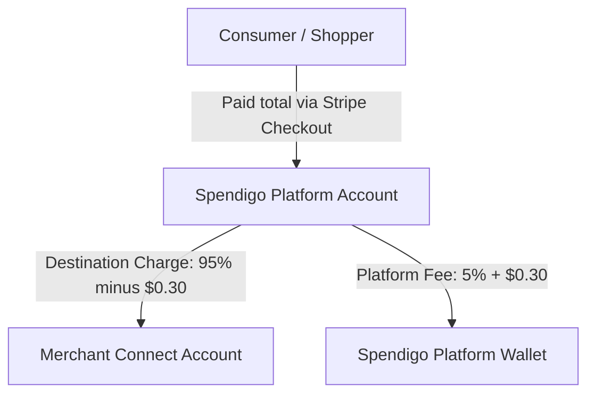

# 💳 Stripe Connect for Merchants: Architecture, Flows, and Implemented Solutions

This document provides a comprehensive overview of how Stripe Connect is integrated into the Spendigo platform for merchants, detailing the multi-party payments architecture, order lifecycles, payment captures, and the technical solutions implemented to resolve previously identified operational and financial gaps.

---

## 🏛️ 1. Spendigo Stripe Connect Architecture

Spendigo utilizes **Stripe Connect** with **Standard Connected Accounts** and **Destination Charges** to handle multi-party online payments.



### Key Components:
1. **Merchant Onboarding (`onboardStore.ts`):** 
   - Spendigo creates a standard Stripe Connect account (`type: 'standard'`) for the merchant store, defaulted to Canada (`CA`) with capabilities for `card_payments` and `transfers`.
   - Onboarding is completed using Stripe-hosted onboarding pages via generated account links (`stripe.accountLinks.create`).
   - The resulting `stripeAccountId` is saved in the store's Firestore document.

2. **Online Payment Capture (`createShopperCheckoutSession.ts`):**
   - When a consumer checks out, Spendigo creates a Stripe Checkout Session in `'payment'` mode.
   - It employs **Destination Charges**: the payment goes directly to the platform (Spendigo), which takes its cut and routes the remainder to the merchant's connected account.
   - **Platform Application Fee:** Spendigo charges a fee of **5% + $0.30** of the order total:
     ```typescript
     const variableFee = Math.round(amount * 0.05); // 5%
     const fixedFee = 30; // $0.30
     const applicationFeeAmount = variableFee + fixedFee;
     ```
   - The PaymentIntent metadata binds the Stripe transaction to the Firestore `orderId` and `storeId`.

3. **Webhooks (`stripeWebhook.ts`):**
   - **`payment_intent.succeeded`:** Fired when a payment goes through. If the order document is already created, its `paymentStatus` is updated to `'paid'`. If the webhook arrives before order placement (race condition), the payment details are saved in a temporary `payments` collection.
   - **`charge.refunded`:** Fired when a refund occurs (full or partial). The webhook queries the order collection by `paymentIntentId` and calculates the actual refund breakdown to update Firestore dynamically.

---

## 🔄 2. End-to-End Process Walkthroughs

### Flow A: Order to Fulfillment (Online Paid)
1. **Shopper Checkout:** Payment processed on the Stripe-hosted checkout.
2. **Order Placement (`placeOrder.ts`):** Decrements stock, validates prices, creates an order in Firestore (`status: 'placed'`, `paymentStatus: 'paid'`).
3. **Merchant View (`Orders.tsx`):** The order appears on the **Kanban Board** under "New Orders 🔔" with a color-coded `💳 Paid` badge.
4. **Processing:** Merchant transitions the order:
   - `placed` ➡️ `preparing` (Triggers shopper push notification).
   - `preparing` ➡️ `out_for_delivery` (Ready for pickup/On route).
   - `out_for_delivery` ➡️ `delivered` (Order Completed).

### Flow B: Order to Fulfillment (In-Store Payment)
1. **Order Placement:** Shopper checks out with `paymentMethod: 'in_store'`. Firestore order is created with `paymentStatus: 'pending'`.
2. **Fulfillment:** Order goes through the same Kanban transitions.
3. **Payment Collection:** The customer pays physically at the store (cash/terminal).
4. **Manual Update:** The merchant clicks **Mark Paid** in the portal, which updates `paymentStatus` to `'paid'` and records the staff actor details.

---

## 🛡️ 3. Implemented Solutions for Operational & Financial Gaps

All previously identified architectural, financial, and operational gaps have been fully resolved with high-reliability backend structures and a premium front-end experience.

### ✅ Solution 1: Automated Stripe Refunds on Order Cancellation
* **Implemented in:** [cancelOrder.ts](file:///Users/I501801/Documents/Projects/Spendigo-v1/services/api/src/orders/cancelOrder.ts)
* **How it works:** When a shopper or merchant cancels a paid order via the `cancelOrder` Cloud Function:
  * If `paymentMethod === 'card'` and `paymentStatus === 'paid'`, the function automatically calls `stripe.refunds.create` using the order's `paymentIntentId`.
  * The order status is transitioned to `'cancelled'` and the `paymentStatus` is updated to `'refunding'` immediately, ensuring perfect state consistency.
  * **Tamper-Evident Atomic Logging:** The logging of `ORDER_CANCELLED` is processed inside the Firestore transaction callback. It fetches the latest serialized chain hash in the READ phase (`db.collection('audit_logs_meta').doc('latest')`) and commits the stock restoration, status cancellation, and audit log document atomically. This guarantees that **no duplicate audit entries** are written on transaction retries.

### ✅ Solution 2: Platform Application Fee Reversal on Refunds
* **Implemented in:** [refundOrder.ts](file:///Users/I501801/Documents/Projects/Spendigo-v1/services/api/src/payments/refundOrder.ts) & [cancelOrder.ts](file:///Users/I501801/Documents/Projects/Spendigo-v1/services/api/src/orders/cancelOrder.ts)
* **How it works:** Every automated or manual card refund API invocation is configured with:
  ```typescript
  refund_application_fee: true
  ```
* **Why it matters:** This instructs Stripe Connect to reverse Spendigo's platform commission and transfer it back to the merchant's connected balance. The platform returns its fee cut for failed/refunded orders, protecting the connected merchant account from absorbing fee losses out of pocket.

### ✅ Solution 3: In-Store Payment Refund & Cancellation Local Override
* **Implemented in:** [refundOrder.ts](file:///Users/I501801/Documents/Projects/Spendigo-v1/services/api/src/payments/refundOrder.ts)
* **How it works:** If a merchant initiates a cancellation or refund for an order paid via `in_store`:
  * The backend detects `paymentMethod === 'in_store'` and bypasses any Stripe API invocations.
  * It immediately transitions the order status to `'cancelled'`, `paymentStatus` to `'refunded'`, and logs the `ORDER_REFUNDED` audit chain record locally.
* **Why it matters:** This establishes database bookkeeping integrity for physical in-store cash transactions, keeping the merchant's portal reports fully synchronized without throwing missing-PaymentIntent failures.

### ✅ Solution 4: Custom-Amount Partial Card Refunds
* **Implemented in:** [refundOrder.ts](file:///Users/I501801/Documents/Projects/Spendigo-v1/services/api/src/payments/refundOrder.ts)
* **How it works:** The merchant portal's refund dialog now includes a custom numeric field allowing merchants to enter a custom amount (e.g. to refund an out-of-stock item rather than cancelling the entire order).
  * If an `amount` parameter is specified, the backend multiplies it to cents (`Math.round(amount * 100)`) and forwards it to Stripe's partial refund handler.
  * The order's `paymentStatus` changes immediately to `'refunding'`, noting the pending `refundingAmount` parameter.

### ✅ Solution 5: Dynamic Webhook Capture for Partial vs. Full Refunds
* **Implemented in:** [stripeWebhook.ts](file:///Users/I501801/Documents/Projects/Spendigo-v1/services/api/src/payments/stripeWebhook.ts)
* **How it works:** The webhook's `charge.refunded` switch case computes the final payment states authoritatively:
  * It translates the cent amount returned by Stripe to dollars: `amountRefunded = charge.amount_refunded / 100`.
  * It compares `charge.amount_refunded` against `charge.amount`.
  * If they are equal, it sets `paymentStatus` to `'refunded'`.
  * If the refund was partial, it sets `paymentStatus` to `'partially_refunded'`, saves the exact `refundedAmount` total, and sets the `refundedAt` Firestore server timestamp.

### ✅ Solution 6: Premium Bookkeeping Reconciliation Grid & Ledger Views
* **Implemented in:** [Orders.tsx](file:///Users/I501801/Documents/Projects/Spendigo-v1/apps/web/src/pages/merchant/Orders.tsx) & [OrderContext.tsx](file:///Users/I501801/Documents/Projects/Spendigo-v1/apps/web/src/context/OrderContext.tsx)
* **How it works:**
  * **Reconciliation View:** Replaced basic summaries with a premium, responsive **4-Column Financial Reconciliation Grid** on the merchant dashboard:
    * **Gross Sales:** Sum of all closed orders (`paid`, `refunded`, and `partially_refunded` states).
    * **Refunds Issued:** Exact cumulative totals of refunds processed (full order values for fully refunded, and partial values for partially refunded).
    * **Net Sales:** The actual merchant take-home earnings (`Gross Sales - Refunds`).
    * **Platform Fees:** Real-time ledger tracking of Spendigo fees (5% + $0.30 per card order, calculated dynamically on net card sales and automatically adjusted for platform fee reversals).
  * **Badges and Info Blocks:** Order cards and row lists display dynamic payment statuses (`Paid`, `Pending`, `Refunding`, `Refunded`, `Partial Refund`). Opening an order detail modal displays a detailed **Payment Info Box** showing payment methods, transaction references, refunds issued, and specific refund reasons.

---

## 🔒 4. Security & Robustness Highlights

1. **Proxy IP Masking Prevention:** The audit logging system in [audit.ts](file:///Users/I501801/Documents/Projects/Spendigo-v1/services/api/src/utils/audit.ts) extracts the primary IP address from proxy load-balancer headers using `x-forwarded-for`, preventing security logs from showing `0.0.0.0` fallbacks.
2. **Optimistic Locking Serialization:** Standard logEvents utilize a centralized `audit_logs_meta/latest` document. By writing to this singleton document within Firestore transactions, concurrent writes are forced to serialize, maintaining strict chronological chain validation.
3. **Application Fee Integrity:** Fee computations are validated server-side, preventing client-side tampered fees or incorrect deductions.
