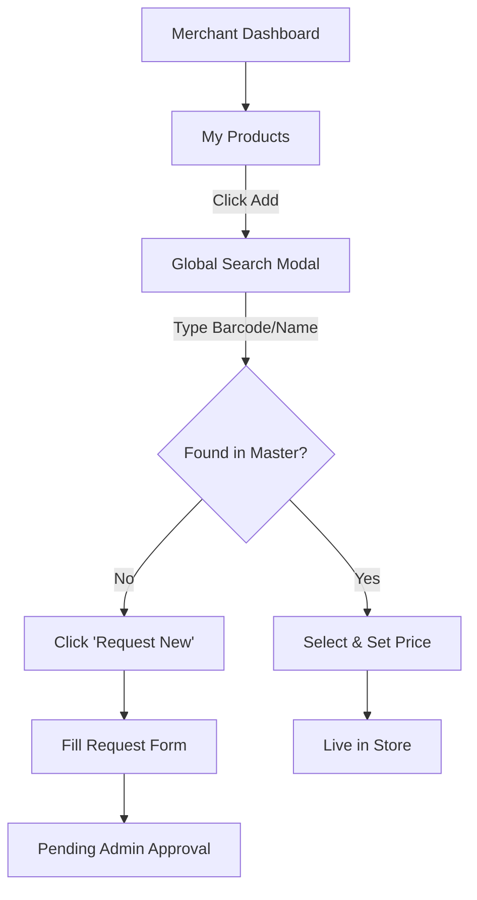

# Spendigo SmartCart — UI Wireframes

**Status**: Implemented (Beta)
**Design System**: Tailwind CSS (Custom Theme: Emerald/Dark)

## 1. Core User Flows (Mermaid)

### 1.1 SmartCart Optimization Flow
*How the user finds the best price.*
```mermaid
graph TD
    A[User Search: "Milk"] --> B[Result List]
    B -->|Click Item| C[Product Detail]
    C -->|Add to Wishlist| D[Wishlist State]
    D -->|Click 'Optimize'| E[Smart Engine]
    E --> F{Cheaper Replacement?}
    F -->|Yes| G[Show "Swap & Save" Modal]
    F -->|No| H[Direct Add to Cart]
    G -->|Accept| I[Replace Item in Cart]
    G -->|Decline| H
```

### 1.2 Merchant Product Management (Hybrid Catalog)
*How a merchant adds inventory.*


## 2. Key Screen Mockups

### 2.1 Consumer: SmartCart Wishlist (`/smartcart`)
*   **Header**: "Your Smart List" (Sticky)
*   **Toggle Switch**: "Strict Mode" (Same Brand) vs "Eco Mode" (Any Brand, lower price).
*   **Main List**: 
    *   Left side: Required Items.
    *   Right side: "Best Deal" found.
    *   Green Arrow pointing to savings amount ("Save $3.50").
*   **CTA**: floating "Add All to Cart" button.

### 2.2 Merchant: Product Editor (`/merchant/products`)
*   **Layout**: Split view.
*   **Left (Locked)**: Master Data (Image, Name, Description, Nutrition).
    *   *Note*: "This data is managed by Spendigo".
*   **Right (Editable)**: Store Data.
    *   Price Input (Large).
    *   Inventory Spinner.
    *   Status Toggle (Active/Hidden).
*   **Footer**: "Save Changes" button.

### 2.3 Admin: Master Catalog Grid (`/admin/catalog`)
*   **Tool**: Data Grid (React Table).
*   **Columns**: Image (Thumbnail), Name, Brand, Barcode, # Stores, Status.
*   **Actions (Row)**: Edit, Merge, Block.
*   **Filter Bar**: "Pending Verification", "Missing Image", "Flagged".
*   **Bulk Actions**: "Export CSV", "Update Tax Category".

### 2.4 Consumer: Store Profile (`/store/:id`)
*   **Hero**: Store Banner Image + Avatar.
*   **Stats**: "0.5km away" • "Delivery: $3.99" • "Rating: 4.8★".
*   **Tabs**: "Flyers" (PDF Viewer), "Deals" (Red Grid), "Aisles" (Categories).
*   **Search**: In-store search bar ("Search FreshMart...").

### 2.5 Checkout: Split Payment (`/checkout`)
*   **Header**: "Secure Checkout".
*   **Order Breakdown**:
    *   **Store A (FreshMart)**: 3 items - $12.50.
    *   **Store B (Bakery)**: 1 item - $5.00.
*   **Payment Method**: Stripe Elements (Card / Google Pay).
*   **Disclaimer**: "You will see two separate charges on your statement."
*   **Submit**: "Pay $17.50".

## 3. Responsive Behavior
*   **Mobile**: Bottom Navigation Bar (Home, Search, Cart, Profile).
*   **Desktop**: Top Navigation Bar with Mega-Menu for Categories. Sidebar for Filters.
